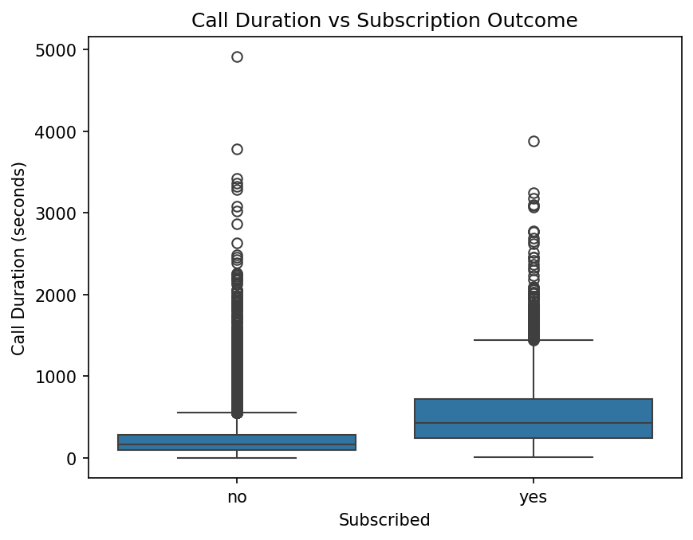

# Optimizing Client Outreach: Predicting Term Deposit Subscriptions for Client B

Using data and machine learning to identify high-probability customers and improve marketing campaign efficiency for Client B.

---

## The Business Problem

Client B runs large-scale digital marketing campaigns to promote term deposits, but most customers do not subscribe. This leads to wasted time and resources, as marketing teams are contacting customers who are unlikely to convert. If Client B continues using a broad, untargeted approach, it will miss opportunities to improve efficiency and increase conversion rates.

## The Data

The dataset contains 45,211 client records and 17 variables describing customer demographics, financial information, and details from previous marketing campaigns. The target variable indicates whether a client subscribed to a term deposit; the outcome is highly imbalanced, with about 88% of customers not subscribing and only about 12% subscribing. The data also contains missing values in several columns, most notably poutcome and contact, which will need to be addressed before modeling. Overall, the dataset provides a strong sample size for analysis, but some preprocessing will be required to handle missing data and prepare the variables for predictive modeling.

## Key Discoveries

- **Older customers are more likely to subscribe:**  While most customers fall between their 30s and 50s, those who subscribe tend to be slightly older, suggesting a stronger interest in long-term savings products.

- **Customers with higher balances convert more often:** Subscribers generally have higher account balances, indicating that financial capacity plays a key role in a customer’s decision to commit to a term deposit.

- **Longer conversations drive successful conversions:** Customers who subscribe consistently have much longer call durations, highlighting the importance of engagement and effective communication during marketing calls.

- **Past campaign success is the strongest predictor:** Customers who previously responded successfully to a campaign are far more likely to subscribe again, making them the highest-value targets for future outreach.

- **Campaign timing has a major impact on results:** Subscription rates vary significantly by month, with some months outperforming others, while high-volume months like May show relatively low conversion rates.

- **Customers without loans are more likely to subscribe:** Customers with no existing loan obligations convert at higher rates, suggesting that financial flexibility increases the likelihood of committing to a savings product.

## Visualizing the Story

*Customers who subscribed consistently had much longer call durations, suggesting that stronger engagement during conversations significantly increases the likelihood of conversion.*

## Prediction Model

A Gaussian Naive Bayes model was used to predict whether a customer would subscribe, achieving approximately 86% accuracy. In practice, this means the model is very effective at identifying customers who are unlikely to subscribe, allowing the client to avoid wasting outreach on low-probability targets. However, the model still misses some potential subscribers, highlighting the trade-off between efficiency and capturing all possible conversions.

## Recommendations

1. **Prioritize customers with successful past campaigns:** Customers with prior successful outcomes convert at about 65%, compared to about 13–17% for others. Targeting this group can significantly increase conversion rates while reducing wasted outreach.

2. **Focus on higher balance customers:** Customers with larger account balances are more likely to subscribe, indicating greater financial capacity. Shifting outreach toward this group can improve campaign efficiency and drive more deposits.

3. **Improve call engagement and quality:** Longer call durations are strongly associated with successful conversions. Investing in better training and more effective call strategies can increase the likelihood of turning conversations into subscriptions.

4. **Optimize campaign timing:** Subscription rates vary by month, with some months outperforming others despite lower call volume. Aligning outreach with higher-performing periods can improve overall campaign effectiveness.

## Tools & Techniques

Python | Pandas | Scikit-Learn | Matplotlib | Seaborn | Gaussian Naive Bayes | Google Colab

---

*This project was completed as part of ISOM 835: Predictive Analytics at Suffolk University\'s
Sawyer Business School.*
